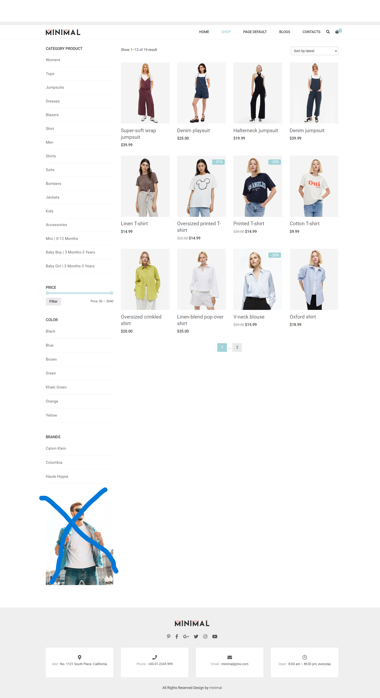
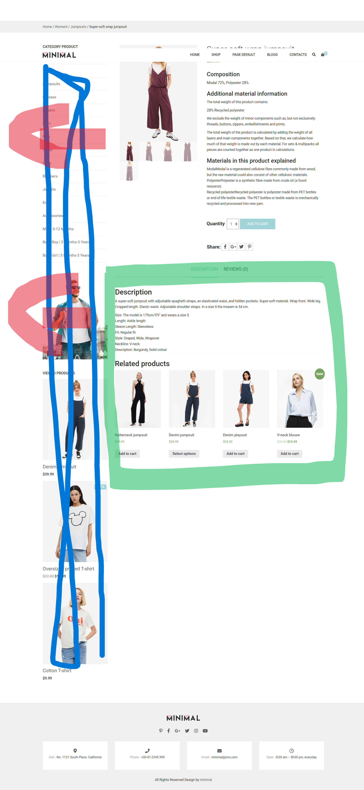
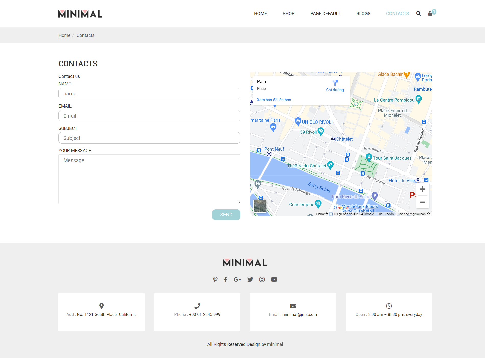
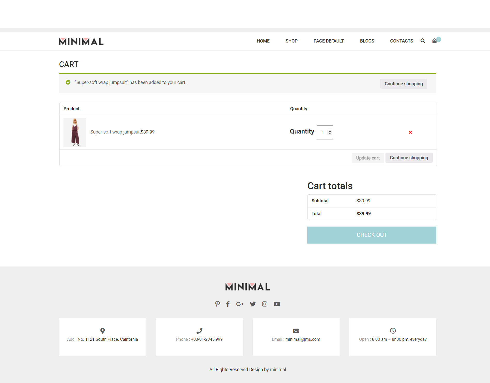
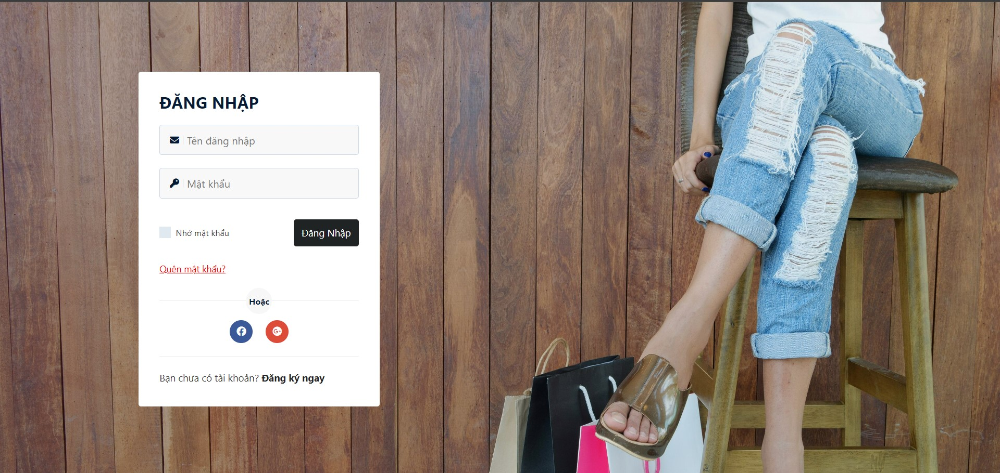

# Nhật ký làm web Website-sells-clothes-and-bags của nhóm

## Task 1 (4/3/2024 -> 23h:59p - 8/3/2024): Hoàn thành giao diện
- Link trang website: [website bán hàng Minimal](https://minimal.crv.vn/)
- Do để tránh khó khăn trong đồ án nên mình đã lượt **bỏ chức năng viết blog**
- **Mình đã viết trang HomePage,Header và Footer** để demo sẵn cấu trúc các thư mục rồi. Hiện giờ còn trang "**shop**", trang "**chi tiết sản phẩm**", trang "**contacts**" và trang "**cart**".

-  Trang **shop**:
   
   

   - **Lưu ý**: bỏ phần được đánh dấu màu xanh, còn lại code y như mẫu rên web (bao gồm hiệu ứng đầy đủ)
   - Làm thêm phần "**phân trang**" (lên youtube tìm hiểu)

- Trang **chi tiết sản phẩm**:
   

   - **Lưu ý**: bỏ phần được đánh dấu màu xanh, còn lại code y như mẫu rên web (bao gồm hiệu ứng đầy đủ). **Kéo toàn bộ nội dung chi tiết sản phẩm ra luôn phần bị xóa.**.
   - Làm cả phần **Description** và phần **Review** nha. (được đánh dấu màu xanh lá cây á).

- Trang **contacts**:
  

  - **Lưu ý**: làm y như mẫu trên web.

- Trang **cart**:
  

  - **Lưu ý**: làm y như mẫu trên web. Khi làm nên lên web thêm một sản phẩm bất kỳ vào vỏ hàng để làm theo cấu trúc. **Lúc có sản phẩm và lúc không có sản phẩm.**

- **Giao việc**:
  - Trang **shop**: Dũng
  - Trang **chi tiết sản phẩm**: Phát.
  - Trang **contacts** : Sang
  - Trang **cart** : Trí

- ## Lưu ý:
  - Các bạn lên githud để **tải toàn bộ thư mục về và làm trên máy các bạn**.
  - **Đến hạn các bạn đóng gói toàn bộ file project lại gửi cho mình trong nhóm zalo để mình tiến hành đẩy code lên**. Tránh trường hợp merge dẫn đến xung đột code.
  - Nếu có lỡ đẩy code lên làm thư mục gốc bị lỗi thì báo mình để mình reset lại nha.

- ## Kết quả hoàn thành task 1: một số lưu ý 
  - Trang **cart**, **chi tiết sản phẩm**, **contacts us**,**shop** đã hoàn thành tốt
  - Trong quá trình làm **có hình ảnh**, mấy phen **nên tải ảnh đó về lưu vào đúng thư mục trong thư mục image** để tiện thao tác chứ **không nên link ảnh đến trang web đó** dễ bị lỗi.
  - Tớ **đã push toàn bộ file các trang hoàn thành tốt lên githud**. Các bạn có thể pull về để kiểm tra xem có sai sót gì không.
  - **Nếu có sai xót gì các bạn nhớ báo tớ trong nhóm zalo nha.**

## Task 2 (từ 18h:46p 9/3/2024 -> 23h:59p - 15/3/2024): Tìm kiếm và đề suất form đăng nhập, đăng ký và giao diện trang admin. Thiết kế lớp DTO và DAO + các bản csdl cơ bản.

- Mỗi người hãy tìm kiếm và đề suất form đăng ký, đăng nhập và giao diện admin. Về form đăng nhập đăng ký, có thể tham khảo web nào cũng được nha (có link web càng tốt), còn về giao diện admin thì mấy phen tham khảo mấy đồ án mà mấy phen từng tham gia xem có cái nào đẹp đẹp hong nha.

- Sau khi kiếm được mẫu sẽ code sau.

- Đây là hình ảnh sơ đồ cở sở dữ liệu của nhóm (đã được thầy Sang tư vấn): 
   

- Có gì tớ thiết kế sơ đối tượng trong lớp DTO với lớp DAO rồi push lên để anh em tham khảo nha, có gì góp ý chung.

- ## Giao việc:
  - **Tìm kiếm và đề xuất hình ảnh về form đăng nhập, đăng ký và giao diện** : Phát, Sang, Dũng, Trí.
  - **Code form đăng nhập, đăng ký**: Sang
  - **Thiết kế cơ bản DTO, DAO + CSDL**: Apu  

- ## Kết quả hoàn thành task 2: một số lưu ý
  - Đã kiếm được form đăng nhập đăng ký và đã code: 
  
  
  - Đã tạo xong các đối tượng trong lớp DTO, file tạo bảng và mối liên kết giữa các bảng trong mySQL trong XAMPP.
  - Chưa hoàn thành việc ghi các câu lệnh truy suất trong lớp DAL.

## Task 3 (18/3/2024 -> 1/4/2024): Chỉnh sửa một số thứ trong CSDL, hoàn thành cơ bản các chức năng trên web phía người dùng

- Về việc chỉnh sửa cơ sở dữ liệu: thêm thuộc tính descriptionMaterial trong sản phẩm Shirt và Handbag.

- Mấy phen nên tạo lại cơ sở dữ liệu mới trong file **"TABLES.sql"** ở lớp DAL và khởi tạo lại dữ liệu trong file **"DATA_CONTRUCTOR.sql"** trước khi chạy web, vì web chưa có cái check xem đã khởi chạy kết nối với database chưa nên nhớ bật **XAMPP** trước khi chạy nha.

- Các chức năng phía người dùng:
  - **Đăng nhập**: cơ bản hoàn thành nhưng chưa kiểm tra dữ liệu đầu vào bằng Js.
  - **Đăng ký**: chưa hoàn thành.
  - **Tìm kiếm sản phẩm theo từ khóa, sử dụng AJAX khi click vào biểu tượng kính lup trên Header**: đã hoàn thành.
  - **Các chức năng ở trang Home**:
    - **Show danh sách các sản phẩm dưới dạng slide bằng AJAX ở phần "Feature"**: đã hoàn thành.
    - **Show danh sách các sản phẩm "New Arrival" bằng AJAX**: chưa hoàn thành
    - **Show danh sách các sản phẩm "Sale Product" bằng AJAX**: chưa hoàn thành
    - **Show danh sách các sản phẩm "New Beslling Product" bằng AJAX**: chưa hoàn thành
    - **Phân loại sản phẩm cho "Men,Woment,Kids", khi click vào sẽ dẫn đến trang shop với giá trị lọc tương ứng**: chưa hoàn thành.
  - **Các chức năng ở trang Shop**:
    - **Phân trang bằng AJAX**: đã hoàn thành.
    - **Các chức năng lọc sản phẩm bằng AJAX**: chưa hoàn thành.
  - **Các chức năng ở trang Chi tiết sản phẩm**:
    - **Xem chi tiết một sản phẩm bằng cách dùng AJAX load dữ liệu lên**: đã hoàn thành.
    - **Load sản phẩm ở phần "Related products" dùng AJAX**: đã hoàn thành.
    - **Load các đánh giá bình luận về sản phẩm bằng AJAX**: chưa hoàn thành.
  - **Các chức năng ở trang Liên hệ**:
    - **Chức năng xác nhận gửi liên hệ bằng AJAX**: chưa hoàn thành.
  - **Các chức năng ở trang Vỏ hàng**:
    - **Chức năng thêm vào vỏ hàng**: chưa hoàn thành.
    - **Chức năng xác nhận mua hàng**: chưa hoàn thành.
  - **Các chức năng ở trang Thông tin người dùng**: 
    - **Show dữ liệu người dùng bằng AJAX**: chưa hoàn thành.
    - **Cho phép chỉnh sửa thông tin người dùng**: chưa hoàn thành.
    - **Show các đơn hàng đã xác nhận và tình trạng của đơn hàng**: chưa hoàn thành.
    - **Chức năng xác nhận thanh toán để hoàn tất một đơn hàng khi bấm xác nhận mua hàng bên trang Vỏ hàng qua**: chưa hoàn thành.

- ## Giao việc:
  - **Code demo một vài chức năng sử dụng AJAX, tạo dựng lơp BLL**: Apu.

- ## Kết quả hoàn thành task 3: một số lưu ý
  - Tuy một số chức năng đã hoàn thành nhưng có thể còn Bug.
  - **Chưa có trang để xem thông tin người dùng, các đơn hàng đã đặt, tình trạng các đơn hàng,...**
  - Cơ sở dũ liệu chưa ổn, có thể chỉnh sửa thêm trong tương lai.
  - **Thiếu phần admin**.

## Task 4 (2/4/2024 -> 28/4/2024): Hoàn thành các chức năng phần User và xây dựng giao diện trang admin

- ## Điều chỉnh cơ sở dữ liệu: 
  - **Bỏ phần phiếu nhập "EnterBallot" và chi tiết phiếu nhập "detailBallot"** trong cơ sở dữ liệu do nhận thấy không cần thiết.

- ## Giao việc:
  - **Xây dựng giao diện website phía admin**: Phát, Dũng, Sang, Trí.
  - **Hoàn thành các chức năng bên phía User**: Apu.

- ## Kết quả hoàn thành task 4: một số lưu ý 
  - **Các chức năng bên phía user**: Còn chức năng liên quan đến đơn hàng (thêm,xem danh sách,..), xác nhận thanh toán, hiển thị thông tin người dùng đăng nhập do chưa có giao diện. Chức năng gửi phản hồi.
  - **Xây dựng giao diện website phía admin"**:..  

## Task 5 (28/4/2024 -> 13/4/2024): Hoàn thành các chức năng phần Admin và thiết kế giao diện website

## Task 6 (14/5/2024 lúc 14h): Đi báo cáo đồ án

- ## Kết quả hoàn thành task 6: một số lưu ý
  - Thầy Nguyễn Thanh Sang cho đồ án **8.5 điểm** do còn một số lỗi và thiếu sót.

  - Dù đồ án không được trọn vẹn và điểm không được cao như những nhóm khác nhưng cũng là nỗ lực và công sức của anh em từ đầu đến cuối.

  - Trong quá trình làm đồ án với nhau, có những lúc tớ hơi mất bình tĩnh và dùng những từ không hay để nói chuyện nên có gì anh em thông cảm bỏ qua cho tớ. Tớ hong có lý do nào để biện hộ cho chuyện đó, chỉ là do những lúc đó tớ thấy lo lắng sợ đồ án không làm kịp nên tớ không giữ được bình tĩnh. Nên có gì mấy ní bỏ qua cho tớ hen.

  - Đây sẽ là lần push git cuối cùng (nếu trong tương lai không có update thêm), kết thúc chuỗi ngày mệt vcl vì chạy đồ án. Rất vui vì đã được làm việc chung với anh em **Nhóm 3 - web2 - kỳ 2 năm 3 - 2024**, chúc anh em thành công trong cuộc sống.

## Các thành viên nhóm web2:
  - **Nguyễn Thanh Sang**: aka thần phù hộ, chiến thần bút tráp.
  - **Trần Tiến Phát**: aka FatNotPhat, "Để phát làm cho".
  - **Nguyễn Trí Dũng**: aka "Kẻ không bao giờ ngủ", "lỗi XAMPP".
  - **Ngô Hoàng Minh Trí**: aka "Tui hong mic được nha", "9 giờ tui mới vô được".
  - **Trương Công Phúc**: aka "8 giờ họp hen mấy phen".

